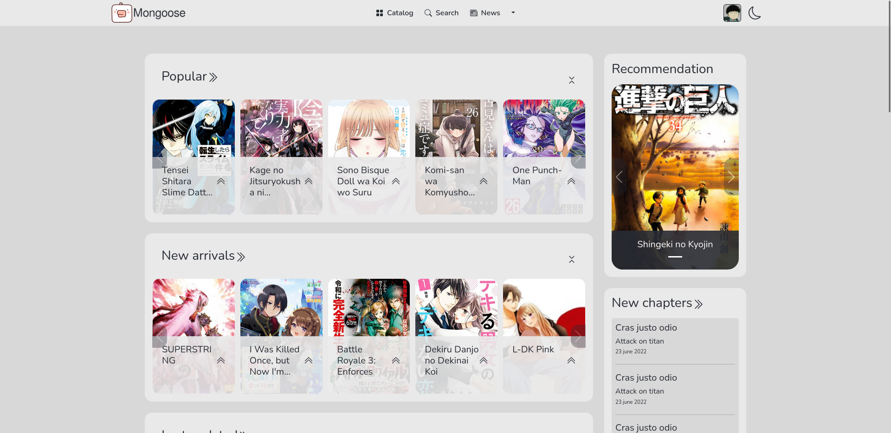
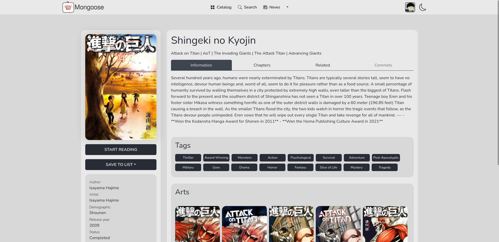
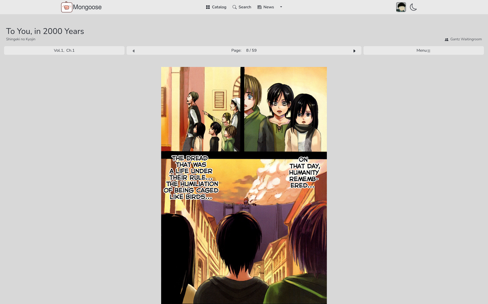
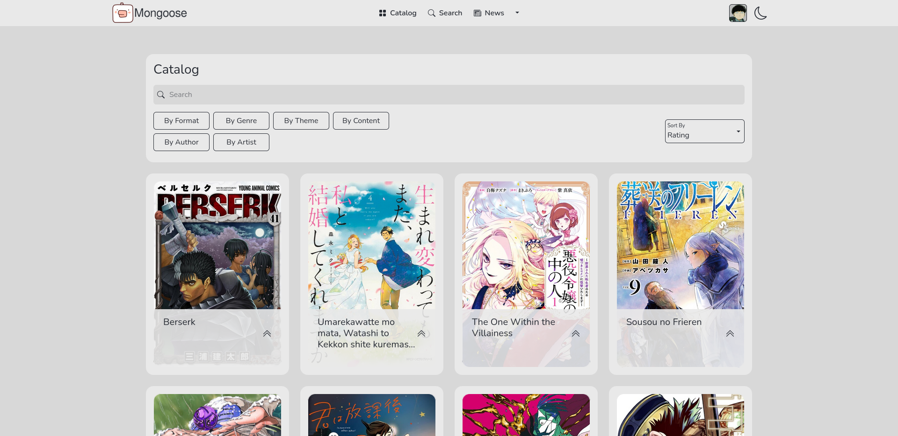
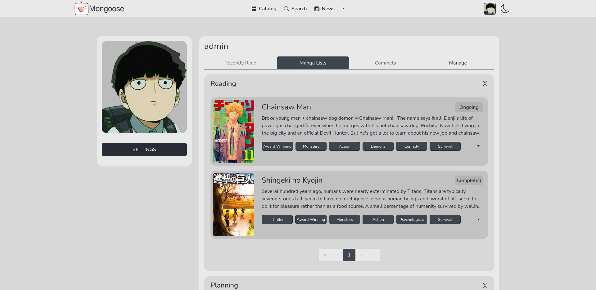

<h1 align="center">Mangoose</h1>

## About
Manga reader website. The project was created with using manga data from <a href="https://api.mangadex.org">MangaDex API</a>.

## Dependencies
There were used next big dependencies:

- react
- redux
- express
- mongoose
- sequelize
- adminjs

Also, the application was containerized using Docker.

## Installation

 - Install Docker and Docker Compose plugin for your OS. You can find installation instructions <a href="https://docs.docker.com/engine/install/">here</a>
 - Run `sudo ./start.sh` or `sudo ./start-dev.sh` script.
 - Open http://localhost:3000/

## Screenshots

  
  
  
  
  

